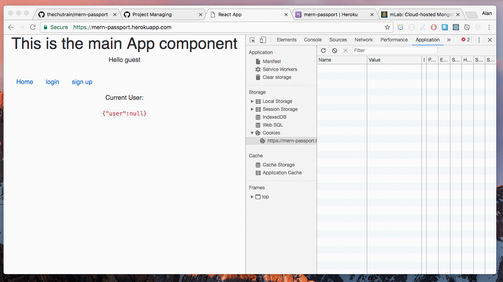

### MERN + Passport.js
> example MERN stack application that uses authentication

* Mongo, Express, React, Node (MERN) + Passport.js for managing authentication
* This project was bootstrapped with [Create React App](https://github.com/facebookincubator/create-react-app).

## Demo

View the live version of this app here:
[https://mern-passport.herokuapp.com/](https://mern-passport.herokuapp.com/)

## Note
* In order to set the google authentication up, you must register your app @ [https://console.developers.google.com](https://console.developers.google.com) & set `GOOGLE_CLIENT_ID` & `GOOGLE_CLIENT_SECRET` as environmental variables
* In development mode (i.e. `npm run dev`), OAuth google callback is not being proxied to the google servers. Therefore in order to test the google OAuth on your local machine do the following:
1) `npm run build`
2) `npm run prod`
